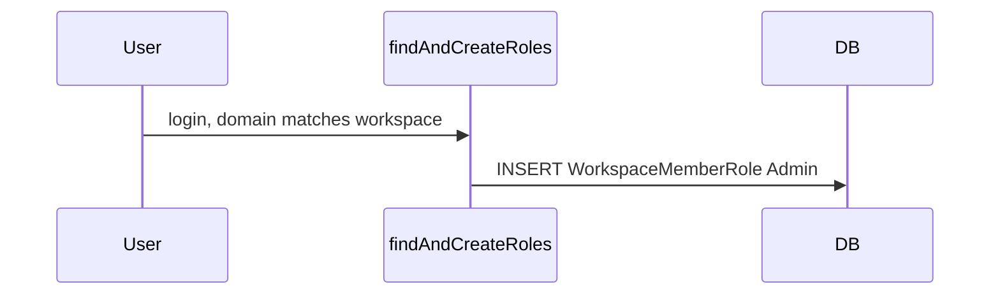

# First domain user Admin, rest Viewer (race-safe)

## Current behavior

In `[packages/backend-lib/src/requestContext.ts](packages/backend-lib/src/requestContext.ts)`, workspaces the user matches by email domain but has no `WorkspaceMemberRole` yet are collected into `domainWorkspacesWithoutRole`. The code always inserts `role: "Admin"` in parallel via `Promise.all` (lines 81–95).

## Target behavior

- For each such workspace, count how many **existing** `WorkspaceMemberRole` rows exist for that `workspaceId` where the related `WorkspaceMember`’s email domain (case-insensitive) equals the workspace’s `domain` (trimmed, lowercased comparison on the email side).
- **Count === 0** → insert **Admin** (first domain user for that workspace).
- **Count >= 1** → insert **Viewer**.
- **Race**: two first-time users from the same domain must not both observe count `0`. Use a **transaction** per workspace and `**SELECT … FOR UPDATE`** on the workspace row so the count + insert are atomic for that workspace.

Parent/child role propagation later in the same function is unchanged; it only runs for users who already have parent roles.

## Implementation

### 1. Helper + transactional provision (same file)

- Import `sql` from `drizzle-orm` and `RoleEnum` from `[./types](packages/backend-lib/src/types.ts)` (already used in tests).
- Add `countMembersWithDomainRoleInWorkspace(tx, { workspaceId, workspaceDomain })` using `tx` (not global `db()`): join `workspaceMemberRole` → `workspaceMember`, filter `workspaceId`, and `sql\`lower(split_part(${dbWorkspaceMember.email}, '@', 2)) = ${normalized}`where`normalized = workspaceDomain.trim().toLowerCase()`. Return` count` (cast to int).
- Add `provisionDomainMatchRole({ member, workspaceRow })` that runs `**db().transaction(async (tx) => { ... })`**:
  1. `tx.select().from(dbWorkspace).where(eq(dbWorkspace.id, workspaceId)).for('update')` — lock the workspace row for the duration of the transaction (Drizzle: `.for('update')` inside `db().transaction`, consistent with common Drizzle 0.38 usage).
  2. Optionally assert row is still `Active` (defensive; matches outer query intent).
  3. `const n = await countMembersWithDomainRoleInWorkspace(tx, …)`.
  4. `insert` into `workspaceMemberRole` with `role: n === 0 ? RoleEnum.Admin : RoleEnum.Viewer`, `onConflictDoNothing`, `returning()`.
  5. Return the inserted row or `undefined`.

### 2. Replace the `Promise.all` block in `findAndCreateRoles`

- **Sort** `domainWorkspacesWithoutRole` by `w.Workspace.id` before iterating — stable lock order when a user matches multiple workspaces, reducing deadlock risk vs arbitrary object order.
- **Sequential** `for … of`: skip if `!w.Workspace.domain?.trim()` or missing member email domain.
- Await `provisionDomainMatchRole` per workspace; append returned roles to `roles` and keep debug logging.

### 3. Tests — `[packages/backend-lib/src/requestContext.test.ts](packages/backend-lib/src/requestContext.test.ts)`

- Keep **“when workspace has a domain”** / first login → still expects `RoleEnum.Admin`.
- **New test** under `findAndCreateRoles` (or extend domain suite): create workspace with fixed domain; insert first `WorkspaceMember` + run `findAndCreateRoles` (or insert role directly as first domain user); create **second** member with same domain; call `findAndCreateRoles` for second member; expect `RoleEnum.Viewer`.
- **Optional race test** (only if practical without flakiness): two parallel `db().transaction`/`provision…` simulations with two different members — harder in Jest; the lock + single transaction is the guarantee; sequential tests are the minimum.

### 4. Optional product copy

- If `[packages/dashboard/src/pages/settings.page.tsx](packages/dashboard/src/pages/settings.page.tsx)` (or similar) says all domain users become Admin, update helper text to: first matching user becomes Admin on first access; additional same-domain users default to Viewer.

## Bootstrap email (`BOOTSTRAP_ONBOARD_EMAIL` / `bootstrapOnboardEmail`)

**Yes — existing bootstrap behavior stays correct and does not require changes in this plan.**

- After `bootstrapWorkspace` runs, `[maybeBootstrapOnboardAdmin](packages/backend-lib/src/bootstrap.ts)` calls `[onboardUser](packages/backend-lib/src/onboarding.ts)` with the configured email. `onboardUser` creates/finds the `WorkspaceMember` and **inserts or upserts `WorkspaceMemberRole` with Admin** for the workspace resolved **by `workspaceName`** (the workspace just created in that bootstrap invocation).
- That user **already has a role row** before they ever hit `findAndCreateRoles`. The domain auto-provision branch only runs for workspaces in `domainWorkspacesWithoutRole` (no existing role for this member on that workspace), so the bootstrap user **does not** go through the “first domain user” insert for that workspace — their Admin comes from `onboardUser`, not from domain matching.

**Interaction with “first domain user = Admin” counting**

- The count used for domain auto-join includes existing members whose **email domain** matches `workspace.domain`. If bootstrap email is `admin@acme.com` and `workspace.domain` is `acme.com`, the count is already **≥ 1** when the next `@acme.com` user logs in, so they correctly get **Viewer** (bootstrap remains the only domain-matched Admin from that path).
- If bootstrap email’s domain **does not** match `workspace.domain`, the bootstrap user is still Admin via `onboardUser`, but they are **not** counted toward the domain-matched count; the **first** user who matches by domain could still get Admin from domain auto-join (possible second Admin). That edge case exists today conceptually; fixing it would mean extending the plan (e.g. always treat bootstrap email as occupying the “first Admin” slot regardless of domain) — **out of scope unless explicitly requested.**

**Scope: “all available workspaces”**

- Today bootstrap only assigns Admin on the **single workspace created in that bootstrap call** (`workspaceName` passed into `bootstrap`), not on every workspace in the database. This plan does **not** add multi-workspace bootstrap; if that product requirement exists, it would be a separate change (e.g. loop workspaces or a new admin API).

## Notes

- **Workspace creator** path that calls `createWorkspaceMemberRole` with Admin remains separate; this plan only changes **domain-match auto join**.
- **Case sensitivity**: workspace `domain` in the initial Drizzle `where` is still `eq(dbWorkspace.domain, domain)` from the raw email part; if production data mixes case, consider a follow-up to normalize stored domain or compare case-insensitively in the workspace query — out of scope unless you want it bundled.
- Lock scope: one row per workspace per provision call; contention is limited to concurrent first-time domain joins for that workspace.

