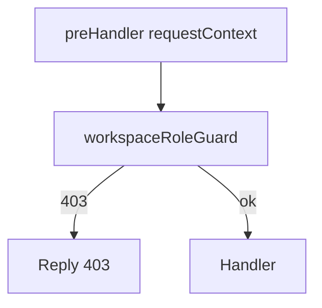

# Enforce workspace roles (API + dashboard)

## Context

- **Role order** (strongest first): Admin → WorkspaceManager → Author → Viewer — see `[packages/isomorphic-lib/src/auth.ts](packages/isomorphic-lib/src/auth.ts)` (`authCodes`) and `[packages/isomorphic-lib/src/workspaceRoles.ts](packages/isomorphic-lib/src/workspaceRoles.ts)` (`WORKSPACE_ROLE_INFO`, `requireWorkspaceAtLeastRole`).
- **Today**: `[packages/api/src/buildApp/requestContext.ts](packages/api/src/buildApp/requestContext.ts)` attaches `memberRoles`, but almost no controllers use them. Only `[packages/api/src/controllers/permissionsController.ts](packages/api/src/controllers/permissionsController.ts)` and `[packages/api/src/controllers/workspacesController.ts](packages/api/src/controllers/workspacesController.ts)` enforce Admin (and only when `authMode === "multi-tenant"`).
- **Non–multi-tenant**: Keep current behavior — **skip** role checks when `backendConfig().authMode !== "multi-tenant"` (same pattern as `denyUnlessWorkspaceAdmin` today).

## 1) Shared API guard

Add a small helper (e.g. `[packages/api/src/buildApp/workspaceRoleGuard.ts](packages/api/src/buildApp/workspaceRoleGuard.ts)`):

- `**denyUnlessAtLeastRole(request, reply, minimumRole): boolean**`  
  - If `authMode !== "multi-tenant"`: return `false` (do not deny).  
  - Read `workspace` + `memberRoles` from `request.requestContext` (same as permissions controller).  
  - Use `**workspace.id**` from context as `workspaceId` for `getWorkspaceRole` / `requireWorkspaceAtLeastRole` (it already matches the active session workspace; body/header workspace is validated in preHandler).  
  - On failure: `reply.status(403).send()` and return `true`.

Optional readability wrappers in **isomorphic-lib** (next to `requireWorkspaceAdmin`): `requireWorkspaceManager`, `requireWorkspaceAuthor` implemented as `requireWorkspaceAtLeastRole` with `RoleEnum.WorkspaceManager` / `RoleEnum.Author` — keeps controllers readable.

**Refactor** `[permissionsController.ts](packages/api/src/controllers/permissionsController.ts)` to use the shared guard instead of duplicating `denyUnlessWorkspaceAdmin` logic (still **Admin** for mutating routes).

## 2) Minimum role per route group (multi-tenant only)

Align with copy in `WORKSPACE_ROLE_INFO`:

| Minimum role         | Scope (mutations only unless noted)                                                                                                                                                                                                                                                                                                                                                                                                                                                                                                                                                                                                                                                                                                                                                                                                                                                                                                                                                                                                                                                                                                                                                                                                                                                                                                                                                                                                                                                                                                    |
| -------------------- | -------------------------------------------------------------------------------------------------------------------------------------------------------------------------------------------------------------------------------------------------------------------------------------------------------------------------------------------------------------------------------------------------------------------------------------------------------------------------------------------------------------------------------------------------------------------------------------------------------------------------------------------------------------------------------------------------------------------------------------------------------------------------------------------------------------------------------------------------------------------------------------------------------------------------------------------------------------------------------------------------------------------------------------------------------------------------------------------------------------------------------------------------------------------------------------------------------------------------------------------------------------------------------------------------------------------------------------------------------------------------------------------------------------------------------------------------------------------------------------------------------------------------------------- |
| **Admin**            | Permissions mutations (existing); `POST /workspaces` (existing). Optionally tighten `**GET /permissions`** to Admin-only if product should hide member emails from Viewers (default: leave GET open to any workspace member unless you choose otherwise).                                                                                                                                                                                                                                                                                                                                                                                                                                                                                                                                                                                                                                                                                                                                                                                                                                                                                                                                                                                                                                                                                                                                                                                                                                                                              |
| **WorkspaceManager** | Operational / credential surface: `[settingsController.ts](packages/api/src/controllers/settingsController.ts)` (all **PUT**/**POST**/**DELETE** that change config, write keys, providers, data sources), `[secretsController.ts](packages/api/src/controllers/secretsController.ts)`, `[integrationsController.ts](packages/api/src/controllers/integrationsController.ts)`, `[apiKeyController.ts](packages/api/src/controllers/apiKeyController.ts)` (admin keys), `[webhooksController.ts](packages/api/src/controllers/webhooksController.ts)` if it mutates workspace webhooks.                                                                                                                                                                                                                                                                                                                                                                                                                                                                                                                                                                                                                                                                                                                                                                                                                                                                                                                                                 |
| **Author**           | “Content” and customer-data writes: `[journeysController.ts](packages/api/src/controllers/journeysController.ts)` (**PUT**/**DELETE** / mutating routes), `[segmentsController.ts](packages/api/src/controllers/segmentsController.ts)`, `[contentController.ts](packages/api/src/controllers/contentController.ts)`, `[broadcastsController.ts](packages/api/src/controllers/broadcastsController.ts)`, `[subscriptionGroupsController.ts](packages/api/src/controllers/subscriptionGroupsController.ts)`, `[subscriptionManagementTemplateController.ts](packages/api/src/controllers/subscriptionManagementTemplateController.ts)` / `[subscriptionManagementController.ts](packages/api/src/controllers/subscriptionManagementController.ts)` (mutations), `[computedPropertiesController.ts](packages/api/src/controllers/computedPropertiesController.ts)`, `[groupsController.ts](packages/api/src/controllers/groupsController.ts)`, `[resourcesController.ts](packages/api/src/controllers/resourcesController.ts)` **POST `/duplicate`**, `[componentConfigurationsController.ts](packages/api/src/controllers/componentConfigurationsController.ts)` if mutating, `[userPropertiesController.ts](packages/api/src/controllers/userPropertiesController.ts)` / `[userPropertyIndexController.ts](packages/api/src/controllers/userPropertyIndexController.ts)` for schema/index **writes**, `[usersController.ts](packages/api/src/controllers/usersController.ts)` **DELETE** (and any other destructive user-data routes). |
| **Viewer**           | No extra guard on **read** routes (GET, and “read-shaped” POSTs like list users/count). Viewers stay allowed to read dashboards data.                                                                                                                                                                                                                                                                                                                                                                                                                                                                                                                                                                                                                                                                                                                                                                                                                                                                                                                                                                                                                                                                                                                                                                                                                                                                                                                                                                                                  |

**Do not** gate `[multiTenantAuthController.ts](packages/api/src/controllers/multiTenantAuthController.ts)` (`/auth/me/`*) beyond existing auth — any signed-in member may read profile / set own password.

**Audit** remaining controllers under `[packages/api/src/controllers/](packages/api/src/controllers/)` (`events`, `deliveries`, `analysis`, `debug`, etc.): apply the same pattern to any **mutating** route that scopes by workspace; leave truly read-only analytics as Viewer-accessible.

## 3) Tests

- **Unit**: Optional tests for new `requireWorkspaceManager` / `requireWorkspaceAuthor` aliases (thin wrappers).
- **Integration/API**: At least one test per tier — e.g. Viewer receives **403** on `PUT /journeys` (Author), **403** on `PUT /settings/...` (WM), **403** on `POST /permissions` (Admin), while **200** on `GET /journeys` with same auth. Reuse existing multi-tenant test harness patterns in the repo (similar to `[packages/backend-lib/src/workspaceRoles.test.ts](packages/backend-lib/src/workspaceRoles.test.ts)` / API tests if present).

## 4) Dashboard UI (defense in depth)

- From `[useAppStorePick](packages/dashboard/src/lib/appStore.tsx)` (or equivalent), read `memberRoles` + active `workspaceId` (already on props/store from `[addInitialStateToProps.ts](packages/dashboard/src/lib/addInitialStateToProps.ts)`).
- Add small hooks or selectors, e.g. `useWorkspaceCapabilities()` returning `{ isAdmin, isWorkspaceManagerOrAbove, isAuthorOrAbove }` using `getWorkspaceRole` + `isAuthorized` / `requireWorkspaceAtLeastRole` from isomorphic-lib (same logic as API).
- **Hide or disable** primary write affordances when below threshold:
  - **Permissions** (`[permissionsTable.tsx](packages/dashboard/src/components/permissionsTable.tsx)`): Admin-only for Add / Edit / Delete / Reset password (match API).
  - **Settings** (`[settings.page.tsx](packages/dashboard/src/pages/settings.page.tsx)`): gate sections — e.g. operational/settings keys/providers at **WorkspaceManager+**, destructive team-only at **Admin**; avoid only gating “Create workspace”.
  - **Journeys / segments / templates / broadcasts pages**: disable save, delete, publish, duplicate when below **Author** (route-level or shared layout wrapper to avoid missing a button).
- Show a consistent **403/snackbar** if an outdated client still calls the API (errors already surface from axios).

## 5) Verification

- Manual smoke: Viewer — browse read-only; Author — edit journey but cannot open admin keys or permissions; WorkspaceManager — edit channel/key settings but cannot change roles; Admin — full.
- Confirm **single-tenant** / **anonymous** modes unchanged (no new 403s).

