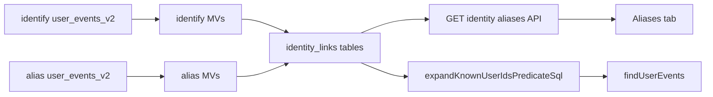

# Identify-based identity links, merged events timeline, and Aliases tab

## Goals

1. **Identify → link**: When a known user identifies and supplies an anonymous id (Segment-style `anonymousId` at message root and/or inside `traits`), persist the same semantic link as `alias` (`anonymous_id` → `user_id` in `identity_links_*`).
2. **Keep `/alias`**: No removal of [submitAlias](packages/backend-lib/src/apps.ts) / [public `/alias](packages/api/src/controllers/publicAppsController.ts)`; alias remains the explicit merge API.
3. **Events timeline**: Viewing a known user should include events stored under linked anonymous `user_or_anonymous_id` values (last-hour and other filters).
4. **Aliases tab**: On single-user details, a new **Aliases** tab lists linked identities and supports opening their profiles.

---

## 1. Schema and payload normalization (isomorphic + ingest)

**Problem today**: [KnownBatchIdentifyData](packages/isomorphic-lib/src/types.ts) / `KnownIdentifyData` allow `userId` **or** `anonymousId` in separate union arms, not both together—yet the merge case needs **both**. Identify [buildBatchUserEvents](packages/backend-lib/src/apps/batch.ts) also nests `anonymousId` only if it were top-level on the message object.

- Extend **Known** identify variants with **optional** `anonymousId` (same `AnonymousId` schema as today) so `userId` + `anonymousId` validates.
- In `buildBatchUserEvents` for Identify: merge **top-level** `anonymousId` onto `messageRaw` (alongside `userId`, `traits`, `timestamp`) when present so ClickHouse defaults in [user_events_v2](packages/backend-lib/src/userEvents/clickhouse.ts) populate `anonymous_id` / `user_or_anonymous_id` correctly.
- **Traits fallback (link + CH columns)**: If `anonymousId` is missing at root but present as `traits.anonymousId` or `traits.anonymous_id`, copy that value to **top-level** `messageRaw.anonymousId` during batch build (and mirror the same logic in [submitIdentify](packages/backend-lib/src/apps.ts), which currently bypasses `buildBatchUserEvents` and only spreads `...rest`—ensure `anonymousId` is not dropped and normalize traits the same way).

Document the behavior in [identityLinks.ts](packages/backend-lib/src/identityLinks.ts) header (ingest paths: alias MV + identify MV + optional traits normalization).

---

## 2. ClickHouse: populate `identity_links`_* from Identify

**Today**: Only [alias MVs](packages/backend-lib/src/userEvents/clickhouse.ts) (`event_type = 'alias'`, `previousId` / `userId`) write to `identity_links_v1` / `identity_links_latest_v1`.

**Approach (safest for upgrades)**: Add **two new** materialized views (do not replace existing alias MVs):

- `identity_links_v1_from_identify_mv` → `identity_links_v1`
- `identity_links_latest_v1_from_identify_mv` → `identity_links_latest_v1`

Each selects from `user_events_v2` where `event_type = 'identify'`, `userId` non-empty, and anonymous id non-empty from:

`coalesce(nullIf(JSONExtractString(message_raw, 'anonymousId'), ''), nullIf(JSONExtractString(message_raw, 'traits', 'anonymousId'), ''), nullIf(JSONExtractString(message_raw, 'traits', 'anonymous_id'), ''))`

Map columns: `anonymous_id` ← that expression, `user_id` ← `JSONExtractString(message_raw, 'userId')`, `linked_at` ← `event_time`, `message_id` ← `message_id`.

Wire these into the `queries` array next to `IDENTITY_LINKS_FROM_ALIAS_MATERIALIZED_VIEWS` in [createUserEventsTables](packages/backend-lib/src/userEvents/clickhouse.ts).

**Note**: `CREATE MATERIALIZED VIEW IF NOT EXISTS` will not alter existing deployments that already ran bootstrap; new MVs apply on fresh creates. For **existing** ClickHouse instances, document a one-time manual step (or add an admin upgrade hook) to run the new `CREATE MATERIALIZED VIEW` statements if you require parity without recreating the DB.

---

## 3. Reconcile hook (assignments / state cleanup)

[submitBatchChunk](packages/backend-lib/src/apps/batch.ts) calls `reconcileLinkedAnonymousUserTables` only when the chunk contains an **Alias**. Extend the condition so it also runs when an Identify in the chunk **creates a link** (top-level or traits-derived `anonymousId` + `userId`). Same after [submitIdentify](packages/backend-lib/src/apps.ts) when a link is present, so ch-sync and the public identify path behave like alias.

---

## 4. Merged events timeline (`findUserEvents`)

[buildUserEventQueryClauses](packages/backend-lib/src/userEvents.ts) uses `AND user_id = …` only, so anonymous-era rows (empty / different `user_id`) never appear for a known profile.

- When `userId` is set, replace the narrow `user_id` predicate with the same semantics as [expandKnownUserIdsPredicateSql](packages/backend-lib/src/identityLinks.ts): match `user_or_anonymous_id` equal to the id **or** equal to any `anonymous_id` linked to that `user_id` in `identity_links_latest_v1 FINAL` (reuse workspace scoping consistent with `buildWorkspaceIdClause` / child workspaces if the events query already does—mirror whatever `findUserEvents` uses for `workspace_id`).
- Apply the **same** predicate in [findUserEventCount](packages/backend-lib/src/userEvents.ts) so pagination counts stay consistent.

Add/adjust tests in [identityLinks.test.ts](packages/backend-lib/src/identityLinks.test.ts) or `userEvents` tests if present.

---

## 5. Profile deep links for linked anonymous users

[getUsers](packages/backend-lib/src/users.ts) applies [excludeLinkedAnonymousUserIdsSql](packages/backend-lib/src/identityLinks.ts) even when scoping with `userIds`, so `/users/[id]` with `id = anon_…` can **404** for anonymous ids that are linked to a known user ([users/[id].page.tsx](packages/dashboard/src/pages/users/[id].page.tsx) uses `getUsers({ userIds: [userId] })`).

- When `userIds` is a **direct** lookup (e.g. non-empty `userIds` and no conflicting list filters, or explicit “by id” mode), **omit** `excludeLinkedAnonymousClause` so linked anonymous profiles remain addressable from the Aliases tab.

---

## 6. API for the Aliases tab

- Add a small authenticated endpoint under [usersController](packages/api/src/controllers/usersController.ts) (e.g. `GET` with `workspaceId` + `userId` query) returning:
  - **If the profile id is a known user**: list of linked `anonymous_id` values from `identity_links_latest_v1` (reuse / wrap [getLinkedAnonymousIdsForKnownUser](packages/backend-lib/src/identityLinks.ts)).
  - **If the profile id is an anonymous id with a link**: return the canonical `user_id` (single row query on `identity_links_latest_v1` by `anonymous_id`) so the UI can show “Merged into …” with a link.

Define request/response TypeBox types in [isomorphic-lib](packages/isomorphic-lib/src/types.ts) (or `backend-lib` types if that is the pattern for internal APIs—match existing `GetUsers`* style).

---

## 7. Dashboard: Aliases tab

- [userTabs.tsx](packages/dashboard/src/components/userTabs.tsx): add tab **Aliases** → `/users/aliases/${userId}` (after Deliveries).
- New page [packages/dashboard/src/pages/users/aliases/[id].page.tsx](packages/dashboard/src/pages/users/aliases/[id].page.tsx): SSR or client fetch to the new API; render a simple table (anonymous id / type / link to profile using existing `Link` + `/users/${id}` pattern).
- Follow existing dashboard patterns for `apiBase` + workspace (see other user subpages).

---

## 8. Testing and docs

- **Unit/integration**: Identify batch + optional `anonymousId` (root + traits) produces link rows (or MV behavior in tests that exercise CH if available); `findUserEvents` returns both known and anonymous-keyed rows; `getUsers` by explicit `userIds` returns linked anonymous user.
- **Docs**: Short note in public SDK / OpenAPI (if generated) that Identify may include `anonymousId` alongside `userId` to establish a link; alias endpoint remains recommended for explicit merges.

---

## Out of scope / explicit non-goals

- Transitive multi-hop “account merge” beyond one anonymous → one known per latest row.
- Rewriting historical `user_events_v2` rows (still join/expand only).

