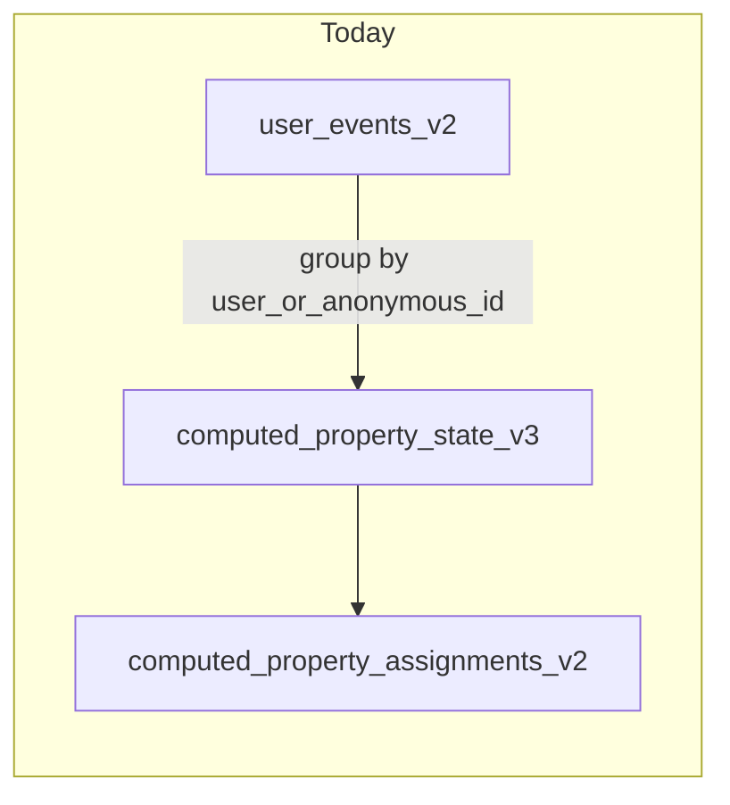
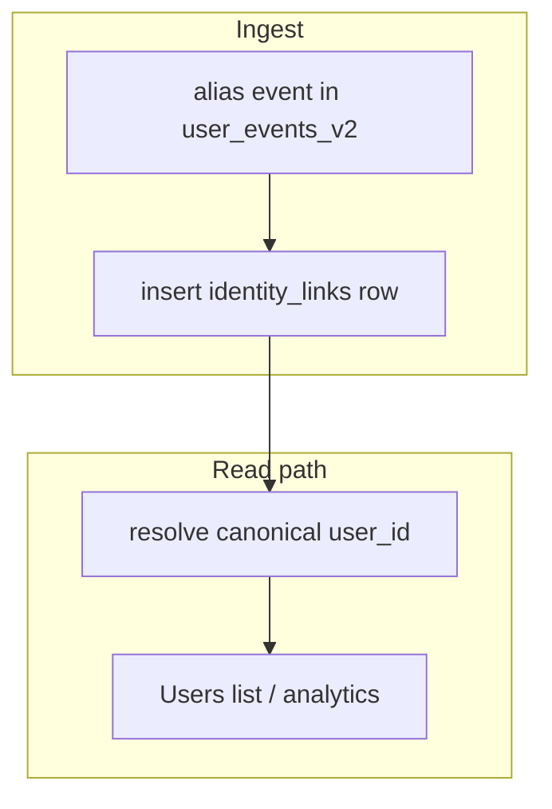

# Identity resolution (anonymous → known) plan

## Current state (repo facts)

- Events land in `[user_events_v2](packages/backend-lib/src/userEvents/clickhouse.ts)` with `user_id`, `anonymous_id`, and `user_or_anonymous_id` (coalesce at ingest). The `event_type` enum already includes `**alias**`, but the public batch schema `**BatchItem` does not** — only Identify / Track / Page / Screen / Group (`[packages/isomorphic-lib/src/types.ts](packages/isomorphic-lib/src/types.ts)` ~3613–3619). Alias payloads are not validated or documented in the SDK contract today.
- Batch ingestion is generic JSON in `[buildBatchUserEvents](packages/backend-lib/src/apps/batch.ts)`; it would pass through an alias-shaped message only if the union were extended and any special handling added.
- Segment incremental state is keyed by `**ue.user_or_anonymous_id`** in inserts into `computed_property_state_v3` (`[computePropertiesIncremental.ts](packages/backend-lib/src/computedProperties/computePropertiesIncremental.ts)` ~3177–3196), and assignments read from that pipeline — so **two IDs = two assignment rows** until merge logic exists.
- Journeys use `**userId`** from the triggering event (`[submitTrackWithTriggers](packages/backend-lib/src/apps.ts)`, `[getUserJourneyWorkflowId](packages/backend-lib/src/journeys/userWorkflow.ts)`); anonymous and known users are different workflow keys until you migrate or unify.

## Target architecture (your “user_master” idea)

Rename for clarity: `**identity_links**` (edges: `anonymous_id` → `user_id`), not a mutable “master row” per user. ClickHouse has no FKs; treat this table as the **authoritative link log** and dedupe in query with a clear rule (e.g. **latest `linked_at` wins** per `(workspace_id, anonymous_id)`).

**Preserve events:** do **not** rewrite `user_events_v2` in the request path. Raw rows stay keyed as ingested; resolution is **join / expand-ID-set** (or a later optional async materialization).

## Phase 1 — Schema and write path (foundation)

1. **Append log table** `identity_links_v1` (name bikesheddable), e.g. columns:
  - `workspace_id`, `anonymous_id`, `user_id`, `linked_at` (from event timestamp), `message_id` (idempotency), optional `previous_id` if you follow Segment-style alias shape.
  - Engine: **MergeTree** ordered by `(workspace_id, anonymous_id, linked_at, message_id)` — optimized for **time-ordered inserts and audit replay**, not for repeated full-table `argMax` scans.
2. **Hot read surface** `identity_links_latest_v1` (or materialized view into it): **one row per `(workspace_id, anonymous_id)`** with the resolved `user_id` and `linked_at` (latest wins). All `getUsers`, segment expansion, and delivery resolution **read this table** (or a view over it), not a scan of the full log. Implementation options: app **upserts** latest on each alias (e.g. `INSERT` into a ReplacingMergeTree / `AggregatingMergeTree` + periodic optimize, or explicit `INSERT …` pattern your CH version supports), or a **materialized view** from `identity_links_v1` that maintains the aggregate (validate merge semantics in CH).
3. **Register tables** next to existing CH bootstrap in `[createUserEventsTables](packages/backend-lib/src/userEvents/clickhouse.ts)` (or a dedicated migration helper called from the same startup path you use today).
4. **API / types:** Add `AliasData` / `BatchAliasData` to `[isomorphic-lib/src/types.ts](packages/isomorphic-lib/src/types.ts)`, extend `BatchItem`, and export OpenAPI if you generate from these types.
5. **Ingest hook:** After successful `insertUserEvents` for a batch chunk (or inside a thin wrapper), **detect `event_type == 'alias'`** (or parse `message_raw`), **append** to `identity_links_v1`, and **update** `identity_links_latest_v1` (same chunk / failure correlation as events). Keep writing the raw event to `user_events_v2` as today (audit + replay).
  - Alternative: only `insertUserEvents` + **ClickHouse MV** into `identity_links_v1` — fewer app round-trips but harder to handle validation/errors; **prefer app-side insert** for clearer failure modes unless you standardize on MVs elsewhere. If MV feeds the latest table, document refresh/lag.
6. **Docs:** SDK doc: call `alias` once when identity is known; optional note on identify with both `userId` and `anonymousId` if you also want to derive links without a separate alias event.

## Phase 2 — Resolution primitives (single source of truth for SQL)

1. **Define resolution policy in one place** (documented):
  - Map `anonymous_id` → `user_id` via `identity_links_latest_v1` (already “latest wins” by construction). Use the append log only for audit, replay, or backfills.
  - **Known `user_id`:** identity is self (unless you later add account-merging — out of scope unless requested).
  - **Chains:** if `user_id` from a link is itself an `anonymous_id` that later links elsewhere, either support **transitive closure** in a periodic job or forbid/document single-hop only for v1.
2. **Expose for reuse:**
  - A **ClickHouse view** or **documented subquery** `canonical_user_id(workspace_id, id)` used by backend query builders, **or** a small TS helper that emits SQL fragments for `[ClickHouseQueryBuilder](packages/backend-lib/src/clickhouse.ts)` consumers. Joins should **always filter `workspace_id` first** to maximize part pruning.
3. **“Expand IDs for events”** helper: given canonical `user_id`, return `IN (user_id, anon1, anon2, …)` for event scans where you need full history (segment definitions, funnels). Prefer a **bounded subquery** against `identity_links_latest_v1` (reverse index or `WHERE user_id = …` if you add that column with care) rather than scanning the append log.

## Phase 3 — Users list: hide duplicate anonymous rows (your UX goal)

`[getUsers](packages/backend-lib/src/users.ts)` is built on `computed_property_assignments_v2` grouped by `user_id` (that field is the **assignment key**, i.e. anonymous vs known are different rows today).

- **Option A (list-only, faster):** Add a `HAVING`/anti-join clause: exclude `user_id` values that appear as `anonymous_id` in `identity_links_latest_v1` (bounded by rows with links, not full history). Users only see **canonical** rows when a link exists; **orphan anonymous** profiles still appear until linked.
- **Option B (stronger):** Re-emit or merge assignments onto canonical `user_id` (requires Phase 4).

Start with **Option A** for minimal blast radius; document that **segment counts** may still differ from “logical people” until Phase 4.

## Phase 4 — Segments / incremental compute (largest engineering cost)

Without this, **segment membership** for “logged-in user includes anonymous history” will be **wrong** in assignments, even if the Users list looks cleaner.

Pick one strategy (or combine):

| Strategy                          | Idea                                                                                                                                                                                               | Tradeoff                                                                                                                                                                                                                  |
| --------------------------------- | -------------------------------------------------------------------------------------------------------------------------------------------------------------------------------------------------- | ------------------------------------------------------------------------------------------------------------------------------------------------------------------------------------------------------------------------- |
| **Query expansion**               | When scanning `user_events_v2`, replace filter on single id with **canonical id + linked anonymous ids** (join/subquery to `identity_links_latest_v1` or optional **dictionary** sourced from it). | Touches many generated queries in `[computePropertiesIncremental.ts](packages/backend-lib/src/computedProperties/computePropertiesIncremental.ts)`; cost stays bounded if workspace-scoped and latest table stays narrow. |
| **State merge job**               | On new link, **merge** `computed_property_state_v3` rows from `anonymous_id` → `user_id` and re-run assignment step for affected users only.                                                       | Complex correctness; good for scale if done rarely.                                                                                                                                                                       |
| **Materialized canonical column** | Async job writes `canonical_user_id` into a projection or side table consumed by compute.                                                                                                          | Operational overhead; very fast reads.                                                                                                                                                                                    |

Recommendation: spike **query expansion** for **one** segment node type first, measure CH cost, then decide merge vs materialization. **Do not** full-workspace recompute on each login; enqueue **per-link** or **debounced** work.

## Phase 5 — Journeys (avoid double entry after merge)

- Today workflow IDs are derived from `[userId](packages/backend-lib/src/journeys/userWorkflow.ts)` passed from the event path.
- On identity link: **either** migrate Temporal workflow state / IDs (high effort), **or** enforce **idempotent entry** so post-merge re-evaluation does not start a second journey (policy + checks before `signalWithStart`).
- This phase should be explicitly scoped with product rules (e.g. “continue anonymous journey under known user” vs “restart”).

## Scalability optimizations (explicit)

1. **Two-tier storage (required at scale)**
  - **Append log:** `identity_links_v1` — full history, audit, replay, backfills.  
  - **Hot read surface:** `identity_links_latest_v1` — one row per `(workspace_id, anonymous_id)` with current `user_id`. **All high-frequency reads** (`getUsers` anti-join, segment ID expansion, deliveries) use this table or a view over it, **not** repeated `argMax` over the log.
2. **ClickHouse physical layout**
  - **ORDER BY** prefix `**(workspace_id, anonymous_id)`** on the latest table so point lookups and semi-joins prune granules. Align partitions with workspace if you partition by tenant.  
  - Keep `**message_id`** on the log for **idempotent** app inserts (skip or dedupe duplicate alias deliveries).
3. **Optional dictionary (hot path)**
  - For per-event or very high QPS resolution, a ClickHouse **dictionary** built from `identity_links_latest_v1` with a defined **reload interval** reduces join overhead; trade **staleness** (seconds/minutes) vs CPU. Use only where profiling shows joins dominate.
4. **Query contracts**
  - **Never** resolve identity without `**workspace_id`**.  
  - **Centralize** SQL in one module (`users.ts`, `computePropertiesIncremental.ts`, `deliveries.ts` import the same fragment/view).
5. **Write backpressure**
  - Bulk alias traffic (imports): **batch inserts** into log + latest in the same **chunking strategy** as `user_events` (reuse `batchChunkSize` patterns) to avoid tiny inserts and coordinator load.
6. **Retention**
  - Typically **retain** identity rows for compliance. If needed, **TTL** or archival applies to **old log partitions** only after the latest table is authoritative; do not drop the log without a compliance review.

## Testing and observability

- **Unit / integration:** insert alias → row in `identity_links_v1` **and** correct row in `identity_links_latest_v1`; duplicate `message_id` idempotent; resolution SQL returns expected canonical id.
- **CH tests:** follow patterns in existing backend-lib ClickHouse tests if present.
- **Metrics:** count links/day, CH query latency on `getUsers` with anti-join against **latest** table, dictionary hit rate (if used), insert lag log → latest.

## Scalability and maintainability (summary)

- **Scalability:** Append log grows with merge events; **read cost stays flat** via `identity_links_latest_v1` + workspace-scoped predicates. Segment expansion uses latest/dictionary; **debounce** per-link recompute jobs; avoid full-workspace scans on login.
- **Features:** Clean extension point for “merged profile” in analytics once canonical resolution is centralized; journeys/segments need explicit phase 4/5 work.
- **Maintainability:** **Centralize** all resolution in one module (SQL fragments + policy doc); avoid copy-pasting join logic across `users.ts`, `computePropertiesIncremental.ts`, and `deliveries.ts`.

## Suggested delivery order

1. Phase 1 + 2 (schema, API, write path, resolution helper).
2. Phase 3 (Users list).
3. Phase 4 (segments) — separate PR with perf validation.
4. Phase 5 (journeys) — product-aligned behavior.

