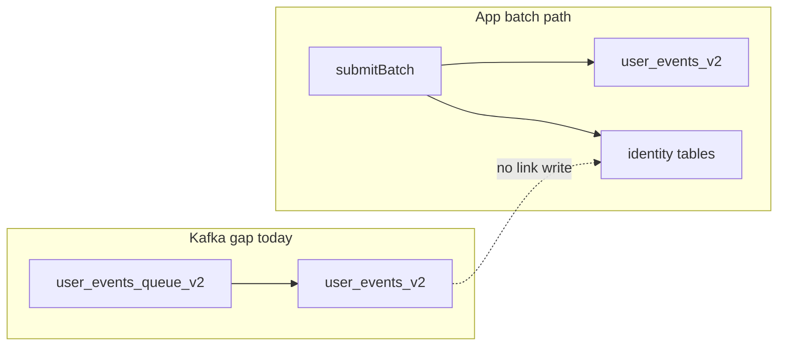

# Remaining identity resolution work

## What is already done (baseline)

- Tables `identity_links_v1` / `identity_links_latest_v1` and batch alias ingest via `[packages/backend-lib/src/apps/batch.ts](packages/backend-lib/src/apps/batch.ts)` + `[packages/backend-lib/src/identityLinks.ts](packages/backend-lib/src/identityLinks.ts)`.
- Users list / count anti-join in `[packages/backend-lib/src/users.ts](packages/backend-lib/src/users.ts)`.
- Canonical grouping key on the **main** `computed_property_state_v3` insert in `[packages/backend-lib/src/computedProperties/computePropertiesIncremental.ts](packages/backend-lib/src/computedProperties/computePropertiesIncremental.ts)` (~3171).
- Keyed **event-entry** journey dedupe in `[packages/backend-lib/src/journeys/journeyIdentityDedupe.ts](packages/backend-lib/src/journeys/journeyIdentityDedupe.ts)`.

## Phase R1 — Ingest completeness (optional but plan-aligned)

| Item                     | Why                                                                                                                                                                                                                                                                                                                                                                                                                                                                                                  |
| ------------------------ | ---------------------------------------------------------------------------------------------------------------------------------------------------------------------------------------------------------------------------------------------------------------------------------------------------------------------------------------------------------------------------------------------------------------------------------------------------------------------------------------------------- |
| **Kafka / MV path**      | App `submitBatch` writes identity rows; `**user_events_mv_v2`** ingestion does not. Add a ClickHouse **materialized view** from `user_events_v2` where `event_type = 'alias'` into `identity_links_v1` (+ same row shape into `identity_links_latest_v1` or a chained MV), **or** document that self-hosted Kafka mode must run a consumer job. Primary file: `[packages/backend-lib/src/userEvents/clickhouse.ts](packages/backend-lib/src/userEvents/clickhouse.ts)` next to existing MV patterns. |
| **Standalone alias API** | Plan mentioned `AliasData` (not only batch). If the public HTTP API only accepts `BatchAppData`, either add a thin `**submitAlias`** in `[packages/backend-lib/src/apps.ts](packages/backend-lib/src/apps.ts)` + route, or explicitly **defer** and keep batch-only (product decision).                                                                                                                                                                                                              |

## Phase R2 — Resolution primitives (finish Phase 2)

| Item                                                               | Why                                                                                                                                                                                                                                                          |
| ------------------------------------------------------------------ | ------------------------------------------------------------------------------------------------------------------------------------------------------------------------------------------------------------------------------------------------------------ |
| `**expandKnownUserIdsSql**`                                        | Plan: given canonical `user_id`, produce `user_or_anonymous_id IN (userId, anon1, anon2, …)` via `identity_links_latest_v1 FINAL` scoped by `workspace_id`. Add next to existing helpers in `[identityLinks.ts](packages/backend-lib/src/identityLinks.ts)`. |
| **Wire `[deliveries.ts](packages/backend-lib/src/deliveries.ts)`** | Today `userId` filters use `user_or_anonymous_id =` / `IN` only (e.g. ~186–195). For **known** users, expand to include linked anonymous ids so message history and joins match merged identity.                                                             |
| **Wire `[analysis.ts](packages/backend-lib/src/analysis.ts)`**     | Same pattern for `filters.userIds` (~168–170, ~442–444).                                                                                                                                                                                                     |
| **Optional dictionary**                                            | Spike only: CH **dictionary** over `identity_links_latest_v1` + reload interval; use if profiling shows correlated subqueries dominate.                                                                                                                      |

## Phase R3 — Assignments / “Option B” (plan Phase 3 follow-up)

| Item                                    | Why                                                                                                                                                                                                                                                                                                                                                                                                                                                                                                 |
| --------------------------------------- | --------------------------------------------------------------------------------------------------------------------------------------------------------------------------------------------------------------------------------------------------------------------------------------------------------------------------------------------------------------------------------------------------------------------------------------------------------------------------------------------------- |
| **Reconcile duplicate assignment keys** | Canonical state may grow on `user_id` while **old rows** still exist under `anonymous_id` in `computed_property_assignments_v2` / `processed_computed_properties_v2`. Options: (a) **one-off + periodic** job merging rows for linked pairs, (b) **backfill** recomputing affected users after alias, (c) document “until recompute, counts may differ.” Ties to workspace delete paths in `[users.ts](packages/backend-lib/src/users.ts)` if you add targeted DELETE by `anonymous_id` after link. |

## Phase R4 — Segment / user-property compute depth (plan Phase 4)

| Item                                                               | Why                                                                                                                                                                                                                                                                                                                                                                                                                                              |
| ------------------------------------------------------------------ | ------------------------------------------------------------------------------------------------------------------------------------------------------------------------------------------------------------------------------------------------------------------------------------------------------------------------------------------------------------------------------------------------------------------------------------------------ |
| **Audit all `user_events_v2` reads**                               | Only the bulk state insert uses `[canonicalUserKeyFromUserEventsSql](packages/backend-lib/src/identityLinks.ts)`. Grep for `from user_events_v2` and `user_or_anonymous_id` in `[computePropertiesIncremental.ts](packages/backend-lib/src/computedProperties/computePropertiesIncremental.ts)` (e.g. assignment builders ~2615+, ~2739+, probe query ~4827) and align **GROUP BY / user key** with canonical semantics where state is per-user. |
| `**joinedPrior` / state dedup**                                    | The `NOT IN (SELECT user_id … FROM computed_property_state_v3)` block (~3153–3167) still compares **legacy anonymous** `user_id` in state vs **canonical** keys on insert—risk of duplicate or skipped updates. Define policy: migrate keys, or widen the anti-join to treat linked ids as same user.                                                                                                                                            |
| **Subqueries using `argMaxValue: "user_or_anonymous_id"`** (~2531) | Confirm whether emitted SQL should use canonical expression instead of raw column for segment nodes that aggregate identity.                                                                                                                                                                                                                                                                                                                     |

## Phase R5 — Journeys (plan Phase 5)

| Item                       | Why                                                                                                                                                                                                                                                                                                                               |
| -------------------------- | --------------------------------------------------------------------------------------------------------------------------------------------------------------------------------------------------------------------------------------------------------------------------------------------------------------------------------- |
| **Segment-entry journeys** | `[triggerSegmentEntryJourney](packages/backend-lib/src/journeys.ts)` uses `getUserJourneyWorkflowId({ userId: segmentAssignment.user_id })` (~862–886). No linked-anonymous dedupe. Decide product rule: skip duplicate if anonymous journey still **RUNNING**, **signal** anonymous workflow, or **allow duplicate** (document). |
| **Workflow ID migration**  | Full “continue anonymous journey as known user” likely needs **Temporal** workflow id change or **signal**-based handoff—large; keep as explicit future epic if not in scope.                                                                                                                                                     |

## Phase R6 — API contract and docs

| Item                       | Why                                                                                                                                                       |
| -------------------------- | --------------------------------------------------------------------------------------------------------------------------------------------------------- |
| **OpenAPI / admin schema** | Regenerate or extend wherever `BatchItem` / batch body is exported so `alias` appears in public docs.                                                     |
| **Developer docs**         | Extend `[packages/docs/integrations/sdks/web.mdx](packages/docs/integrations/sdks/web.mdx)` with Kafka caveat and batch-only vs dedicated alias endpoint. |

---

## Expanded todo breakdown by phase

The actionable checklist is in the plan **frontmatter** (`todos`, 40 items). Each `content` line starts with `**[R1]`–`[R6]`** for the phase. Summary:

| Phase  | Count | Focus                                                                                                             |
| ------ | ----- | ----------------------------------------------------------------------------------------------------------------- |
| **R1** | 7     | Kafka/MV for alias → identity tables; optional `submitAlias` + route                                              |
| **R2** | 12    | `expandKnownUserIds` SQL + tests; `deliveries` + `analysis` wiring + tests; optional dictionary baseline/DDL      |
| **R3** | 5     | Assignment / processed-property reconciliation design, implementation, hook, tests                                |
| **R4** | 8     | Full `computePropertiesIncremental` audit; assignment queries; probe; argMax; joinedPrior design/implement; tests |
| **R5** | 4     | Segment-entry journey product doc + implement + tests; future epic note for workflow migration                    |
| **R6** | 4     | OpenAPI locate/update; web SDK docs; ops note for FINAL/OPTIMIZE                                                  |

---

## Suggested order

1. **R2** (expand SQL + deliveries + analysis) — highest user-visible consistency, localized changes.
2. **R4** (incremental compute audit) — correctness for segments/user properties.
3. **R3** (assignment reconciliation) — aligns counts with “logical users.”
4. **R5** (segment-entry journey policy + minimal code).
5. **R1** (Kafka MV) and **R6** (OpenAPI/docs) in parallel with QA.
6. **Dictionary** only after metrics justify it.

