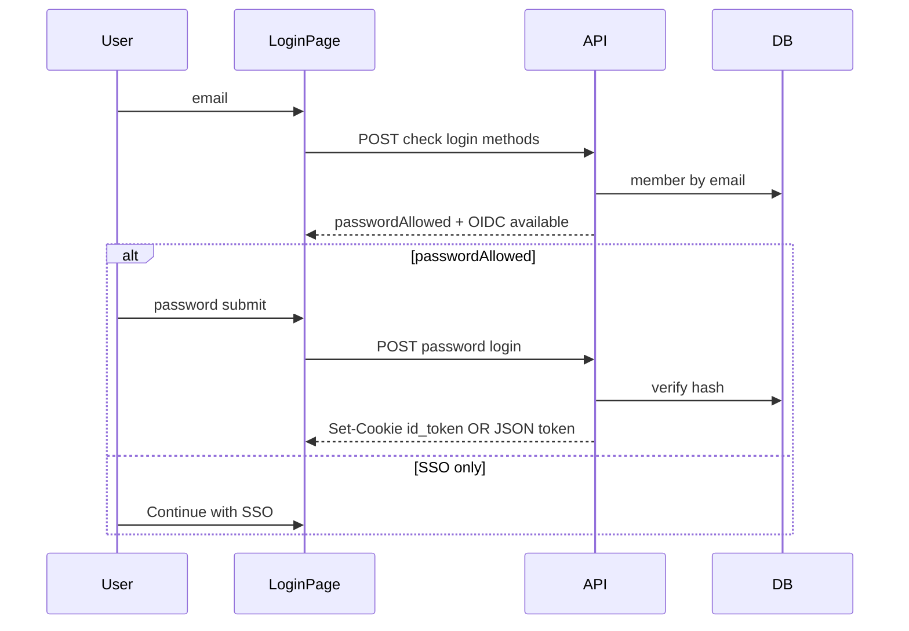

# Multi-tenant email/password login and password management

## Current state

- `[WorkspaceMember](packages/backend-lib/src/db/schema.ts)` has email, profile fields, and **no password** column. Auth is OIDC-only for multi-tenant: `[login.page.tsx](packages/dashboard/src/pages/login.page.tsx)` redirects to the IdP; `[oauth2/callback/sso.page.tsx](packages/dashboard/src/pages/oauth2/callback/sso.page.tsx)` sets `OIDC_ID_TOKEN_COOKIE_NAME`; `[getMultiTenantRequestContext](packages/backend-lib/src/requestContext.ts)` decodes Bearer/cookie as `[OpenIdProfile](packages/backend-lib/src/types.ts)` (`sub`, `email`, `email_verified`, etc.) and resolves/creates `[WorkspaceMembeAccount](packages/backend-lib/src/db/schema.ts)` rows keyed by `(provider, providerAccountId)` with `provider = config().authProvider`.
- `[decodeJwtHeader](packages/backend-lib/src/auth.ts)` uses `fast-jwt` `createDecoder()` (decode-only). Password sessions should use **signed, verified** JWTs (e.g. HS256 with `config().secretKey` or a dedicated secret env) to avoid accepting arbitrary tokens.

## Architecture

- **Session token**: Issue a JWT whose payload satisfies `OpenIdProfile` and is accepted by `getMultiTenantRequestContext`. Use a **stable `sub` namespace** that cannot collide with the IdP, e.g. `dfpwd:<workspaceMemberId>` (or similar prefix). On each request, account lookup uses `(config().authProvider, sub)` as today; first successful password login inserts `[WorkspaceMembeAccount](packages/backend-lib/src/db/schema.ts)` if missing (same pattern as OIDC after line 403 in `requestContext.ts`). Same human can have two rows: OIDC `sub` and `dfpwd:...` — unique index is on `(provider, providerAccountId)` only, so this is allowed.
- **Verification**: Add `createVerifier` (or equivalent) in `[auth.ts](packages/backend-lib/src/auth.ts)` for tokens with a dedicated `iss` (e.g. `dittofeed-password` from config) and short-to-medium `exp` (align cookie `maxAge` with SSO, ~7d). Reject tokens that fail verification before building `OpenIdProfile`. Optionally tighten OIDC path later (out of scope unless you want IdP JWKS verification in the same change).

## Data model

- Drizzle migration: add `**passwordHash`** (nullable `text`) on `WorkspaceMember`. Null/absent means **password login disabled** for that member (SSO only).
- Hashing: add a vetted library (e.g. `**@node-rs/argon2`** or `argon2`) in `backend-lib`; hash on write, `verify` on login. Do not log passwords or hashes.

## API (packages/api)

1. **Public (unauthenticated), multi-tenant only**
  - `POST /auth/login-methods` (name flexible): body `{ email }`. Response: `{ passwordEnabled: boolean, oidcEnabled: boolean }`.  
    - `oidcEnabled`: existing check (`openIdAuthorizationUrl` + client id present).  
    - `passwordEnabled`: member exists **and** `passwordHash` is non-null (and optionally `emailVerified` if you require it).  
    - Use **uniform timing** and **generic errors** where practical to reduce enumeration (e.g. fixed minimum delay, same response shape for unknown email).
  - `POST /auth/password-login`: body `{ email, password }`. Verify hash, require member eligible for dashboard same as today (`findAndCreateRoles` / onboarded). On success: set **same httpOnly cookie** as SSO (`[OIDC_ID_TOKEN_COOKIE_NAME](packages/isomorphic-lib/src/constants.ts)`) with signed JWT, or return token only if you prefer header-based — cookie matches existing `[getRequestContext](packages/backend-lib/src/requestContext.ts)` cookie read path.
2. **Authenticated**
  - `GET /auth/me/profile` (name flexible): multi-tenant only; returns data for **My Profile** — at minimum `{ email, hasPassword: boolean, workspaces: [{ workspaceId, workspaceName, role }] }` for the current member (query all `WorkspaceMemberRole` rows joined to `Workspace` for `member.id` from request context). Optionally include read-only profile fields already on `WorkspaceMember` (`name`, etc.) if useful.
  - **Self-service** `PUT /auth/me/password`: body `{ newPassword, newPasswordConfirm }` and **optional** `currentPassword`.
    - If member’s `passwordHash` is **null** (SSO-only today): **omit** `currentPassword`; session proves identity — set initial hash (enables password login going forward).
    - If `passwordHash` is **set**: **require** `currentPassword`; verify against hash before replacing (standard change-password).
    - Guard: `authMode === "multi-tenant"` and valid request context; resolve member from context (same member as JWT/session).
  - **Admin (workspace)**: `PUT …/member-password` (or equivalent): body `{ workspaceId, email, newPassword }`. Reuse `[denyUnlessWorkspaceAdmin](packages/api/src/controllers/permissionsController.ts)`; verify target member has a **role in `workspaceId`** before updating hash. Used by **Reset password** in Permissions UI.
  - **Create user with optional password**: extend `[createWorkspaceMemberRole](packages/backend-lib/src/rbac.ts)` / `CreateWorkspaceMemberRoleRequest` with **optional** `initialPassword` (or `password`). After find-or-create `WorkspaceMember`, if provided, hash and set `passwordHash` (overwrite only when creating new member or explicit product rule: e.g. set whenever provided and admin — document as “admin sets/resets initial password on invite”).
3. **Security**
  - Add **rate limiting** on `login-methods` and `password-login` (e.g. `@fastify/rate-limit` per IP + email bucket, or a small in-process limiter to start).
  - Strong password policy (min length; optional complexity) validated in TypeBox schemas in `[isomorphic-lib](packages/isomorphic-lib/src/types.ts)` or API-only.

## Dashboard

- `[login.page.tsx](packages/dashboard/src/pages/login.page.tsx)`: After multi-tenant + OIDC config checks, extend UI:
  - Email field + “Continue” → call `login-methods` → if `passwordEnabled`, show password field + submit; else hide password and show copy: “Sign in with SSO only for this account.”
  - Keep **Continue with SSO** when `oidcEnabled`.
  - On password success, redirect to `/journeys` (mirror SSO callback).

### My Profile (new page — not under main Settings)

- **Route**: e.g. `[packages/dashboard/src/pages/profile.page.tsx](packages/dashboard/src/pages/profile.page.tsx)` (follow existing `*.page.tsx` convention and dashboard `basePath`).
- **Entry point**: add **“My Profile”** in the header profile dropdown `[profileTab.tsx](packages/dashboard/src/components/layout/header/headerContent/profile/profileTab.tsx)`, linking to `/profile` (respecting base path). **All** multi-tenant users (including workspace Admins) use this same page for **their own** email, password, and workspace list.
- **Content**:
  - **Email** — read-only from `GET /auth/me/profile`.
  - **Update password** — `PUT /auth/me/password`: **Set password** when `hasPassword` is false (no `currentPassword`); **Change password** when true (require current + new + confirm).
  - **Access to workspaces** — list from `GET /auth/me/profile` (workspace name + role per row).

Do **not** add self-service password UI to `[settings.page.tsx](packages/dashboard/src/pages/settings.page.tsx)`.

### Permissions section (Settings → Permissions)

- **Rename**: user-visible **“Add Permission”** → **“Add User”** (toolbar button, modal title, and related copy/snackbars).
- **Add User modal** (`[permissionsTable.tsx](packages/dashboard/src/components/permissionsTable.tsx)`): keep email + role; add **optional** password + confirm. Submit calls create-member-role API with optional `initialPassword`; if omitted, new user remains SSO-only / can set password in My Profile.
- **Row kebab menu** (order): **Edit** → **Reset password** → **Delete**. **Reset password** opens a dialog (new password + confirm) and calls admin member-password API for the **current workspace** and selected member email.

## Config

- Optional flags in `[config.ts](packages/backend-lib/src/config.ts)`: e.g. `enablePasswordLogin` (default true in multi-tenant when implemented) and `passwordJwtIssuer` / reuse `secretKey` for signing. Document in `[docker-compose.lite.env.example](docker-compose.lite.env.example)` if new env vars.

## Tests

- Unit tests: password hash verify helper; JWT sign/verify round-trip for internal issuer.
- Integration/API tests: login-methods responses; password-login sets cookie; admin endpoint 403 for non-admin; member not in workspace cannot receive password update; `PUT /auth/me/password` without `currentPassword` succeeds when hash null (authenticated SSO session); fails or 400 when hash set but current missing/wrong; `GET /auth/me/profile` returns workspaces for member; create user with optional `initialPassword` sets hash; without password leaves hash null.

## Files to touch (expected)

| Area               | Files                                                                                                                                                                                                                                             |
| ------------------ | ------------------------------------------------------------------------------------------------------------------------------------------------------------------------------------------------------------------------------------------------- |
| Schema + migration | `[packages/backend-lib/src/db/schema.ts](packages/backend-lib/src/db/schema.ts)`, new drizzle SQL                                                                                                                                                 |
| Auth + context     | `[packages/backend-lib/src/auth.ts](packages/backend-lib/src/auth.ts)`, `[packages/backend-lib/src/requestContext.ts](packages/backend-lib/src/requestContext.ts)` (only if account/sub handling needs a small branch for verified internal JWTs) |
| Config             | `[packages/backend-lib/src/config.ts](packages/backend-lib/src/config.ts)`                                                                                                                                                                        |
| API                | New `authPasswordController` (or split), register in app router; extend `[permissionsController.ts](packages/api/src/controllers/permissionsController.ts)` or adjacent                                                                           |
| Types              | `[packages/isomorphic-lib/src/types.ts](packages/isomorphic-lib/src/types.ts)` for request/response bodies                                                                                                                                        |
| Dashboard          | `[login.page.tsx](packages/dashboard/src/pages/login.page.tsx)`, API client hooks, `[permissionsTable.tsx](packages/dashboard/src/components/permissionsTable.tsx)`, settings page for self-service                                               |

## Out of scope / follow-ups

- IdP JWT signature verification for OIDC tokens (security hardening).
- Password reset via email (forgot-password flow).

SSO-only users are **not** stuck on password: once logged in via OIDC, they can **self-set** a password from **My Profile** (no admin required). Login page remains “password field only if `login-methods` says password enabled” for **unauthenticated** flows; after self-set, `passwordEnabled` becomes true for that email.