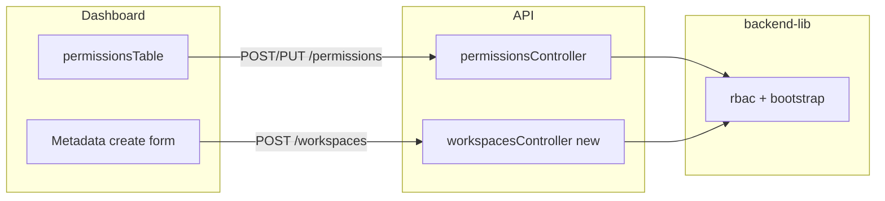

# Workspace roles UI + Admin workspace creation

## Context (important)

- **Four roles** are already defined in `[packages/isomorphic-lib/src/types.ts](packages/isomorphic-lib/src/types.ts)` (`RoleEnum`: Admin, WorkspaceManager, Author, Viewer) and ordered in `[packages/isomorphic-lib/src/auth.ts](packages/isomorphic-lib/src/auth.ts)` via `authCodes` (lower number = stronger).
- **Today, almost no API routes call `isAuthorized`** (grep shows no usage outside `auth.ts` itself). So assigning `Viewer` vs `Admin` **persists in Postgres** but **does not yet change** what most endpoints allow. Role copy in the UI should describe the **intended** ladder (and can note that full route-level enforcement is incremental if you want transparency).
- The permissions UI is already limited to **multi-tenant** mode (`[getMenuItems` / `PermissionsSettings` in `settings.page.tsx](packages/dashboard/src/pages/settings.page.tsx)`). Workspace creation should follow the same gating.

---

## 1) Permissions: all roles + descriptions

**Data / copy**

- Add a small exported map in **isomorphic-lib** (e.g. next to `RoleEnum` or in a new `packages/isomorphic-lib/src/workspaceRoles.ts`): `WORKSPACE_ROLE_INFO: Record<Role, { label: string; summary: string }>` with four entries. Wording should match the **hierarchy** in `authCodes`:
  - **Admin** — full control; team and workspace settings; all resources.
  - **WorkspaceManager** — manage workspace configuration, channels, keys, and operational settings; intended stricter than Author for destructive/admin actions.
  - **Author** — create/edit journeys, templates, segments, broadcasts (content/editor workflows); no team management.
  - **Viewer** — read-only access to dashboards and resources.

(Adjust phrasing to taste; keep consistent with future `isAuthorized(requiredRole)` usage.)

**UI** — `[packages/dashboard/src/components/permissionsTable.tsx](packages/dashboard/src/components/permissionsTable.tsx)`

- In `PermissionDialog`, replace the single `MenuItem` for Admin with **all four** `RoleEnum` values.
- Show the brief next to each option (MUI pattern: `MenuItem` containing a small `Stack` with `Typography` variant `body2` + `caption`/`color="text.secondary"` for `summary`), or a `Select` + `FormHelperText` that updates when `role` changes.
- Default for **new** invites can stay `Admin` or default to `Viewer` (product choice; recommend **Viewer** as safer default when expanding roles).

**API / security (recommended in same PR)**

- In `[packages/api/src/controllers/permissionsController.ts](packages/api/src/controllers/permissionsController.ts)`, for **POST / PUT / DELETE**, require the caller to have `**Admin` in the workspace identified by `body.workspaceId` / `query.workspaceId`** (compare to `GET`, which can remain available to any member who already has access, or restrict to Admin if you prefer a stricter team directory). Use `member` + `memberRoles` from `request.requestContext` (set in `[packages/api/src/buildApp/requestContext.ts](packages/api/src/buildApp/requestContext.ts)`).
- Implement a tiny shared helper (e.g. in `backend-lib` or `isomorphic-lib`) such as `getWorkspaceRole(memberRoles, workspaceId)` and `requireWorkspaceRole({ memberRoles, workspaceId, minimumRole: RoleEnum.Admin })` built on existing `isAuthorized` from `[packages/isomorphic-lib/src/auth.ts](packages/isomorphic-lib/src/auth.ts)` so checks stay consistent.

---

## 2) Workspace Metadata: create workspace + auto-onboard

**Backend**

- Add a **service function** in `backend-lib` (e.g. `packages/backend-lib/src/workspaces/createWorkspaceFromDashboard.ts` or next to `[bootstrap.ts](packages/backend-lib/src/bootstrap.ts)`) that:
  1. Accepts `{ workspaceName, workspaceDomain?: string }` and the **current member email** (or `workspaceMemberId`).
  2. Calls existing `[bootstrapWorkspace](packages/backend-lib/src/bootstrap.ts)` with `workspaceType: Root` (and optional domain) so the new workspace gets the same default user properties, write key, subscription groups, etc. as CLI bootstrap.
  3. On success, grants the creator **Admin** via existing `[createWorkspaceMemberRole](packages/backend-lib/src/rbac.ts)` (or shared insert logic) for the **new** `workspaceId` — same outcome as `onboardUser` but keyed by id to avoid ambiguous workspace names.
  4. Maps known failures to HTTP errors: name conflict / invalid domain → **400/409**, validation → **400**.
- Add a **new Fastify controller** (e.g. `[packages/api/src/controllers/workspacesController.ts](packages/api/src/controllers/workspacesController.ts)`) with `POST /` (mounted at `/api/workspaces` in `[packages/api/src/buildApp/router.ts](packages/api/src/buildApp/router.ts)` inside the authenticated group).
  - **Authorization**: only if `authMode === multi-tenant` **and** the caller has `**Admin` in the *current* context workspace** (`request.requestContext.get("workspace").id` matched against `memberRoles`). Return **403** otherwise.
  - Request/response types in **isomorphic-lib** (TypeBox schemas mirroring other controllers): e.g. `CreateWorkspaceRequest` / `CreateWorkspaceResponse` with `id`, `name`.

**Dashboard** — `[packages/dashboard/src/pages/settings.page.tsx](packages/dashboard/src/pages/settings.page.tsx)` `Metadata()` component (~2276+)

- Extend **Workspace Metadata** with a **“Create workspace”** card (visible only when `authMode === "multi-tenant"` **and** current user’s role in the active workspace is `Admin`, derived from `useAppStorePick(["memberRoles", "workspace"])` the same way as server-side checks).
- Fields: **name** (required), optional **domain** (align with bootstrap / `findAndCreateRoles` domain matching — same semantics as `[docker-compose` / bootstrap options](packages/admin-cli/src/bootstrap.ts)).
- On success: call existing flow `**/select-workspace?workspaceId=...`** (or `router.push`) so `lastWorkspaceId` updates and the user lands in the new workspace (same pattern as `[select-workspace.page.tsx](packages/dashboard/src/pages/select-workspace.page.tsx)`).
- Use `axios` + auth headers consistent with `[usePermissionsMutations.ts](packages/dashboard/src/lib/usePermissionsMutations.ts)`.

---

## 3) Tests and docs

- **Unit test** the role helper (`getWorkspaceRole` / `requireWorkspaceRole`) with a few `memberRoles` fixtures.
- Optional: lightweight API test or integration test for `POST /api/workspaces` (403 for non-Admin, 201 + role row for Admin).
- One-line note in `[docker-compose.lite.env.example](docker-compose.lite.env.example)` or internal comment that workspaces can be created from Settings when multi-tenant (optional; skip if you prefer no doc churn).

---

## Out of scope (unless you want to expand)

- Enforcing **Author/Viewer/WorkspaceManager** on every API route and dashboard section (large follow-up: wrap Fastify routes or add a `preHandler` registry).
- **Parent/Child** workspace types from the UI (bootstrap already supports types via CLI; keep UI to **Root** unless you explicitly need parent/child creation).

