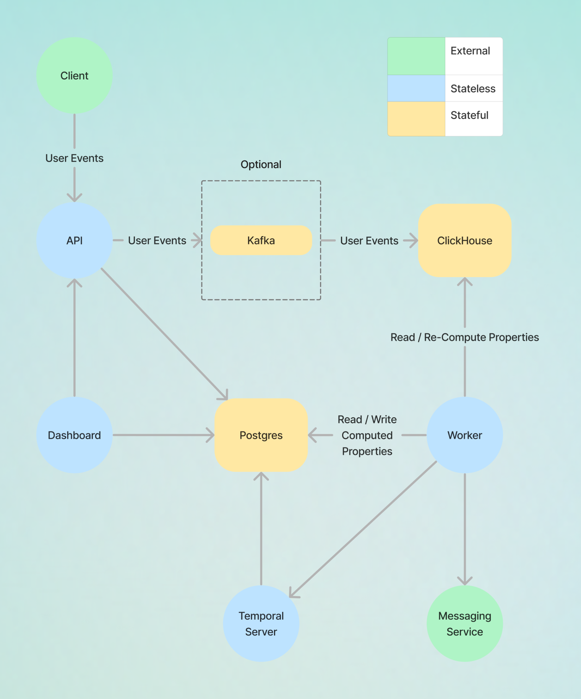

  <a href="https://dittofeed.com">
    <picture>
      
    </picture>
  </a>

---

## Open-source customer engagement

[Dittofeed](https://dittofeed.com) is an omni-channel customer engagement platform. Create automated user journeys to message users along any channel: email, mobile push notifications, SMS, custom webhooks, Slack, and more. We're an open source, dev-friendly alternative to platforms like OneSignal, Customer.io, and Segment Engage.

 

 

- 1️⃣ Connect user data via Segment, Reverse ETL, or the Dittofeed API ⛓️
- 2️⃣ Create highly customizable user segments with multiple operators 🧍🏽‍♀️🧍🏻‍♂️🧍🏾
- 3️⃣ Design messaging templates using HTML, MJML, or Markdown 👨🏻‍🎨
- 4️⃣ Automate user journeys with a powerful, easy-to-use GUI interface 🛩️
- 5️⃣ Integrate with major ESPs like Sendgrid and Amazon SES 🏰
- 6️⃣ Track and analyze message performance from the dashboard 🎯

 

 

### Dashboard Views

  
<b>Journey Builder</b>

  

  
<b>Segmentation</b>

  

  
<b>Template Editor</b>

  

### Architecture

  
<b>Visual Diagram</b>

  

For the full dashboard experience, play around with the [demo app](https://demo.dittofeed.com/dashboard).

## Quick Deployment

Click Deploy to Render below and follow the prompts to deploy Dittofeed on Render. See the "Self-Host with Render" [docs for more info](https://docs.dittofeed.com/deployment/self-hosted/render).

## Roadmap

☑️ = in development | ✅ = in production

### Q1: January 1 to March 31

| Feature                       | Purpose                                                                                                                                                              | Status  |
|-------------------------------|----------------------------------------------------------------------------------------------------------------------------------------------------------------------|---------|
| Webhook channel               | New message channel supporting arbitrary requests to user-specified APIs.                                                                                            | - ✅ |
| Low code template builder     | Allows members to build email templates in a low-code interface without manual encoding in MJML.                                                                     | - \[ ]   |
| Performance work on time-based segmentation | Optimization of [computePropertiesWorkflow](https://github.com/dittofeed/dittofeed/blob/0477114238af27d4f42f3d368266a79823956236/packages/backend-lib/src/segments/computePropertiesWorkflow.ts#L46-L113) to reduce segment update times. | - ✅ |
| Basic White Labeling Support  | Allow workspace members to provide their own branding, for the dashboard.                                                                                                                                                                 | - ✅ |
| AWS SES Support               | Support SES as an email service provider.                                                                                                                                                                      | - ✅ |

---

### Q2: April 1 to June 30

| Feature                       | Purpose                                                                                                               | Status  |
|-------------------------------|-----------------------------------------------------------------------------------------------------------------------|---------|
| Complete git-based workflows  | Allows members to manage journey, segment, and template resources via git, including branching workflow for merging.   | - \[ ]   |
| Identity resolution           | Enables joining of users based on traits or behavior, important for identifying anonymous users post sign-up/sign-in. | - \[ ]   |
| User grouping                 | Provides a way to represent a collection of users (e.g., club, company, team) for segment membership conditions.      | - \[ ]   |

---

### Q3: July 1 to September 30

| Feature                      | Purpose                                                                                               | Status  |
|------------------------------|-------------------------------------------------------------------------------------------------------|---------|
| LLM Integration              | Drives the generation of journeys, segments, and templates.                                           | - \[ ]   |
| Granular Permissions Model   | Enhances the permissions model for more restricted access to the dashboard.                           | - \[ ]   |
| Embeddable Components        | Enables embedding of Journey Builder, Segment Builder, Template Builder, etc., into third-party apps. | - \[ ]   |

---

## Developer-centric

Beyond having industry-standard GUI tools, we focus on developer happiness with first-in-class dev-focused features:

- Branch-based git worflows that support messaging campaign version control.
- Write email templates in your favorite editor, checked into git - not in an unversioned web based IDE.
- Testing SDK to test your messaging campaigns in CI. No more manually QAing them in production.
- Self-hostable. Protect your sensitive PII inside of your own VPC. Avoid volume-based pricing.
- Journey monitoring and alerting.

More to come...

## Support

If you're interested in trying us out, please get in touch!

* [Discord community](https://discord.gg/HajPkCG4Mm)
* [Email support](mailto:support@dittofeed.com)
* [Open an issue](https://github.com/dittofeed/dittofeed/issues/new)
* [Book a meeting](https://calendly.com/d/zy7-8d5-jdq/dittofeed-demo-founders)

## Contributing

For instructions on how to run Dittofeed locally and contribute to this project, see Dittofeed's [contributing docs](https://docs.dittofeed.com/contributing/).

## License

[MIT licensed](/LICENSE), and free forever.
