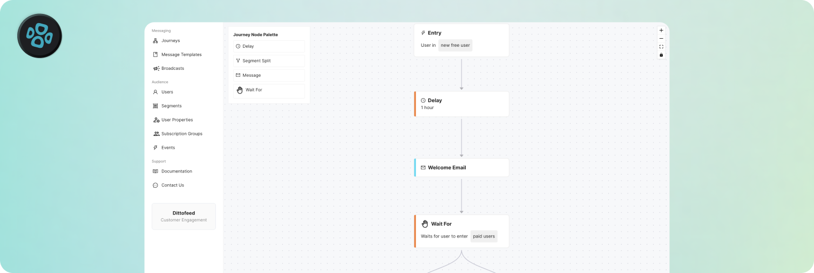
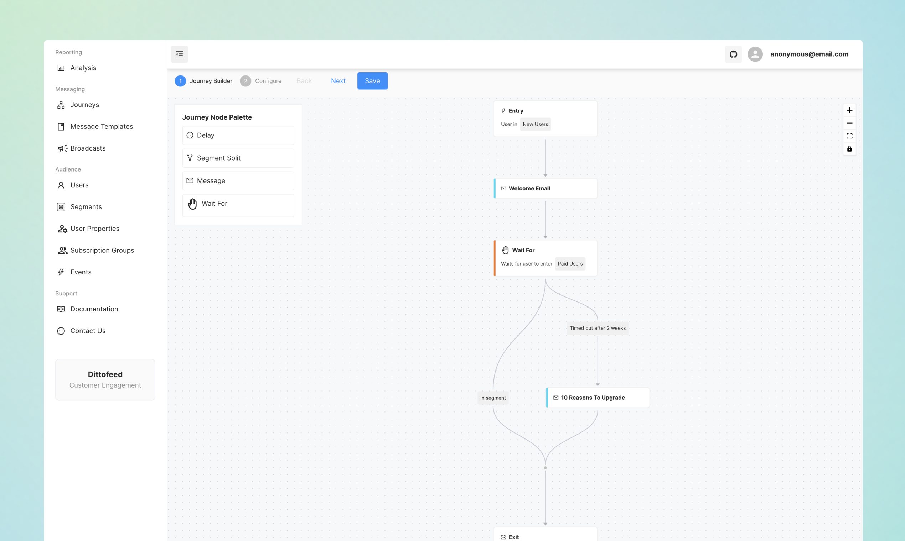
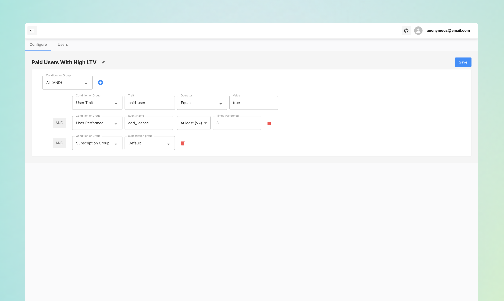
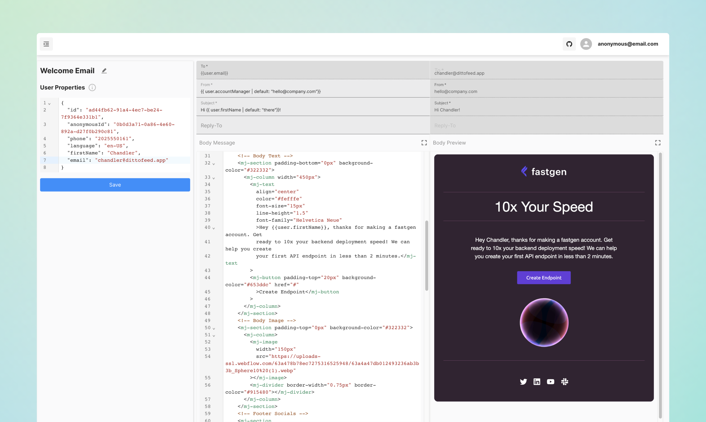

  <a href="https://dittofeed.com">
    <picture>
      <source media="(prefers-color-scheme: dark)" srcset="https://raw.githubusercontent.com/dittofeed/dittofeed/main/packages/docs/logo/dark.png">
      
    </picture>
  </a>

---

<h2 align="center">Open-source customer engagement</h3>

  <a href="https://app.dittofeed.com/dashboard">Start Cloud Trial</a> | <a href="https://docs.dittofeed.com/introduction">Docs</a> | <a href="https://discord.gg/HajPkCG4Mm">Discord</a> | <a href="https://docs.dittofeed.com/contributing/running-locally">Contributing</a>

[Dittofeed](https://dittofeed.com) is an omni-channel customer engagement platform. Send broadcasts or create automated user journeys to message users along any channel: email, mobile push notifications, SMS, WhatsApp, Slack, and more. We're an open source, dev-friendly alternative to platforms like OneSignal, Customer.io, and Segment Engage.

- 1️⃣ Connect user data via Segment, Reverse ETL, or the Dittofeed API ⛓️
- 2️⃣ Create highly customizable user segments with multiple operators 🧍🏽‍♀️🧍🏻‍♂️🧍🏾
- 3️⃣ Design messaging templates using HTML/MJML, or our low-code editor 👨🏻‍🎨
- 4️⃣ Send one-off broadcasts or automated event-based journeys with an easy-to-use GUI interface 🛩️
- 5️⃣ Integrate with major ESPs like Sendgrid and Amazon SES 🏰
- 6️⃣ Track and analyze message performance from the dashboard 🎯
- 7️⃣ Embed any combination of our tools in your own app via iframe or headless react component!* 🤩

 

*[Email support](mailto:support@dittofeed.com) to learn more about our licensed closed-source codebase, which includes features like multi-tenancy, embedding, and white-labeling.

 

 

### Dashboard Views

  
<b>Journey Builder</b>

  

  
<b>Segmentation</b>

  

  
<b>Template Editor</b>

  

### Architecture

  
<b>Visual Diagram</b>

  

For the full dashboard experience, play around with the [demo app](https://demo.dittofeed.com/dashboard).

## Docker Deployment

Check out our [walkthrough video](https://youtu.be/kZbDvVCylVg?si=Gt7xbcQ-_hk6fqKt) for an end-to-end tutorial on deploying with docker compose and automating your first message. Accompanying documentation can be found [here](https://docs.dittofeed.com/deployment/self-hosted/docker-compose).  

## Quick Deployment

Click Deploy to Render below and follow the prompts to deploy Dittofeed on Render. See the "Self-Host with Render" [docs for more info](https://docs.dittofeed.com/deployment/self-hosted/render).

## Roadmap

☑️ = in development | ✅ = in production

### Q4 2024: Oct 1 to Dec 31

| Feature                       | Purpose                                                                                                       | Status  |
|-------------------------------|---------------------------------------------------------------------------------------------------------------|---------|
| Low code template builder     | Allow members to build email templates in a low-code interface without manual encoding in MJML.               | - ✅  |
| Embedded components (private beta)  | Enable embedding of Journey Builder, Segment Builder, Template Builder, etc., into third-party apps.    | - ✅  |

---

### Q1 2025: Jan 1 to Mar 31

| Feature                      | Purpose                                                                                                         | Status  |
|------------------------------|-----------------------------------------------------------------------------------------------------------------|---------|
| Replace Prisma with Drizzle  | Enhance memory efficiency and stability.                                                                        | - ✅  |
| User grouping                | Provide a way to represent a collection of users (e.g., club, company, team) for segment membership conditions. | - ✅  |
| Identity resolution          | Enable joining of users based on traits or behavior. Important for identifying anonymous users post sign-up/sign-in. | - ☑️  |
| Embedded components (public release)  | Implement internal dashboard for embedded low code components. Write great docs. Create demo projects. | - ☑️  |
| Expand Emailo functionality  | Add more commands to the low code email editor command palette to improve email editing experience.             | - \[ ]  |
| Deprecate Postgres user property & segment assignments  | Improve computed properties efficiency.                                              | - ✅  |

---

### Q2 2025: Apr 1 to Jun 30

| Feature                      | Purpose                                                                                                         | Status  |
|------------------------------|-----------------------------------------------------------------------------------------------------------------|---------|
| LLM Integration              | Drive quicker, easier generation of journeys, segments, and templates.                                          | - \[ ]  |
| Stripe integration           | Sync customer data between Stripe and Dittofeed.                                                                | - \[ ]  |
| Git-based resources          | Track changes, audit, and transfer resources between workspaces.                                                | - \[ ]  |

---

## Developer-centric

Beyond having industry-standard GUI tools, we focus on developer happiness with first-in-class dev-focused features:

- Branch-based git workflows that support messaging campaign version control.
- Write email templates in your favorite editor, checked into git - not in an unversioned web based IDE.
- Testing SDK to test your messaging campaigns in CI. No more manually QAing them in production.
- Self-hostable. Protect your sensitive PII inside of your own VPC. Avoid volume-based pricing.
- Journey monitoring and alerting.

More to come...

## Support

If you're interested in trying us out, please get in touch!

* [Discord community](https://discord.gg/HajPkCG4Mm)
* [Email support](mailto:support@dittofeed.com)
* [Open an issue](https://github.com/dittofeed/dittofeed/issues/new)
* [Book a meeting](https://calendly.com/d/zy7-8d5-jdq/dittofeed-demo-founders)

## Contributing

For instructions on how to run Dittofeed locally and contribute to this project, see Dittofeed's [contributing docs](https://docs.dittofeed.com/contributing/).

## License

[MIT licensed](/LICENSE), and free forever.
